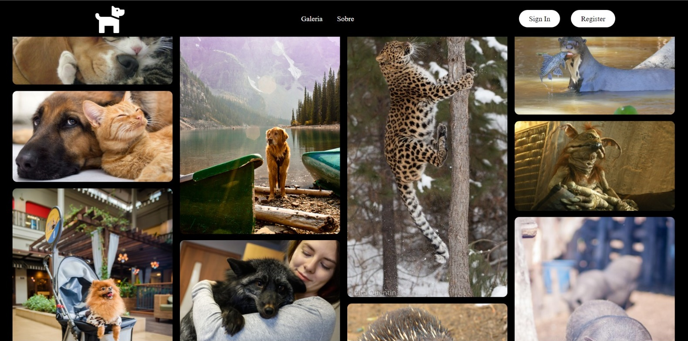

# Projeto III de Experiência Criativa - Pet Shop

Esse projeto foi desenvolvido durante a disciplina de experiência criativa do curso de Ciência da Computação. Ele foi construído a partir de react e simula um pet shop.

### `npm start`

É possível rodar o projeto digitando o comando "npm start" na pasta raiz do projeto. Ele então poderá ser acessado por meio do link: <a href="http://localhost:3000">http://localhost:3000</a>.

